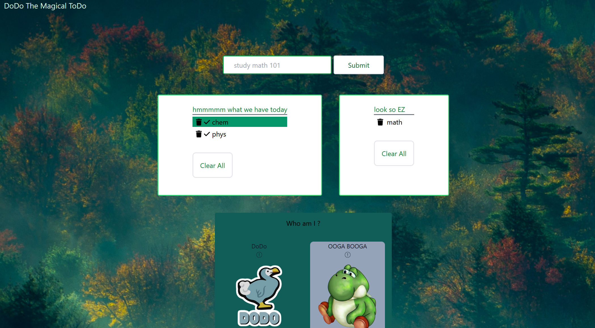

# DodoTheMagicalToDo
Todo with a small twist.
one of the major problems when doing tasks is seeing some tasks hard and procrastinate them. this todo could randomize the todos(and you could only finish them one by one), which would hopefully remove this problem.

**Link to project:** https://dodothemagicaltodo.netlify.app/

## How It's Made:

**Tech used:** HTML, CSS(tailwind), JavaScript, Node. 

my goal of this project was to learn tailwind and challenge myself with some javascript DOM manipulation. 

## Optimizations

I think the UI colors and design could be better. maybe making a tutorial to the user at first visit.

## Lessons Learned:

I started this project to learn tailwind and i succeed in this regard and found it easier and faster to work with than vanilla CSS.
local storage was another goal of this project which i also got familiar with.
